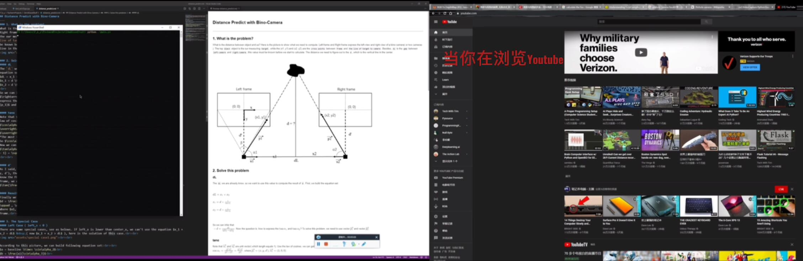
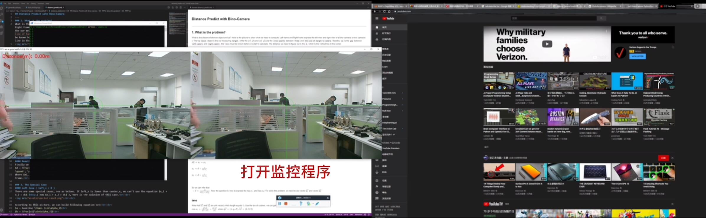
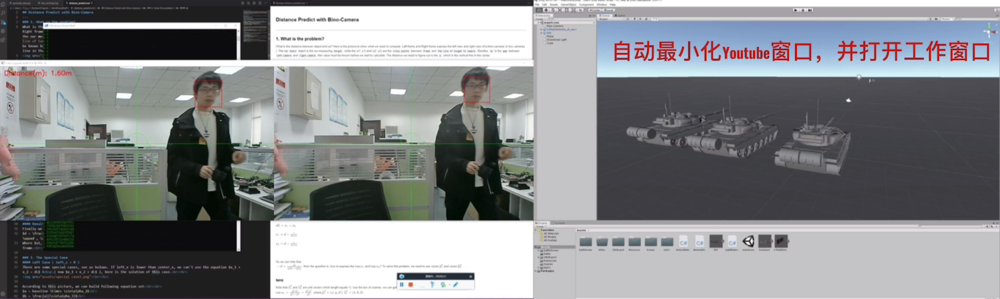

## I am a good staff
---
### 1. Introduction
This is a demo which implenments by python. Run this program while you are playing games or watching videos. When anyone comes into your camera, this program will track him and calculate the distance between your computer and that person. If the distance becomes lower than a threshold(you can change this value if you need), your game window will minimize automatically and your work-window will jump to the top of your laptop.<br>
The key technologies of this project are `face-detection` and `distance-predict`.The face-detection skill is based on python-opencv, which named "CascadeClassifier". While the distance-predict skill is using `two-view` camera to get the `different position` (on left & right frame) of `the same object` and calculate the depth(See details in following chapter).

### 2. Usage
Run this program with following command, you can change the `distance_threshold` in the main.py. `distance_threshold` is the min-safe-distance, if someone walks into this distance, the Youtube will be minimized while the work-window will be set as the top window. See the example video at `assets/example_video.mp4`.
```python
python main.py
```
<br>
<br>
<br>
<br>


### 3. Class Diagram
This project has 6 basic classes, each class's members and methods show as belows.<br><br>


### 4. Program Flow Chart
The program flow chart shows as below.<br><br>


