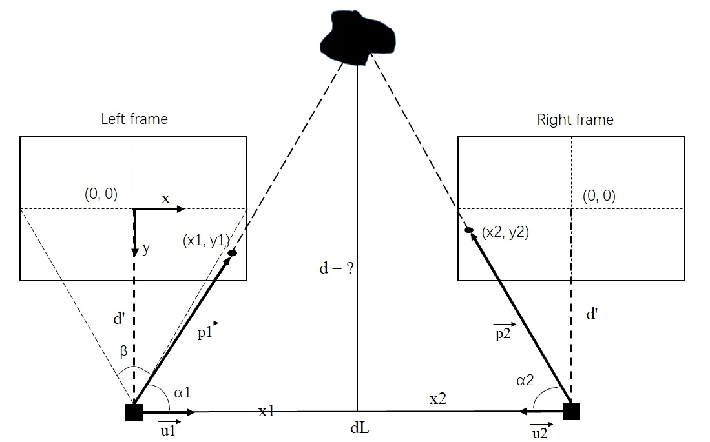

## I am a good staff

### 1. Introduction
This is a demo which implements by python. Run this program while you are playing games or watching videos. When anyone comes into your camera, this program will track him and calculate the distance between your computer and that person. If the distance becomes lower than a threshold(you can change this value if you need), your game window will minimize automatically and your work-window will jump to the top of your laptop.<br>
The key technologies of this project are `face-detection` and `distance-predict`.The face-detection skill is based on python-opencv, which named "CascadeClassifier". While the distance-predict skill is using `two-view` camera to get the `different position` (on left & right frame) of `the same object` and calculate the depth(See details in following chapter).

### 2. Usage
Run this program with following command, you can change the `distance_threshold` in the main.py. `distance_threshold` is the min-safe-distance, if someone walks into this distance, the Youtube will be minimized while the work-window will be set as the top window:

```python
python main.py
```

<div align=center></div>

 

### 3. Distance Predict with Bino-Camera(theory chapter)

> Now the key problem is **how to get the distance between the person and the camera**? Let's see how I implement this method if you are interested about it.

What is the distance between object and us? Here is the picture to show what we need to compute. Left frame and Right frame express the left-view and right-view of a bino-camera( or two cameras ). The top `black` object is the our measuring **target**, while the (x1, y1) and (x2, y2) are the **cross points** between **frame** and **the line of target to camera**. Besides, **dL** is the gap between **left-camera** and **right-camera**, this value must be known before we start to calculate. The distance we need to figure out is the **d**, which is the vertical line in the center.

<div align=center></div>

Let's solve this problem now!

* **dL**

The `dL` we are already know, so we want to use this value to compute the result of `d`. First, we build the equation set:
$$
dL = x_1 + x_2 \\
x_1 = d \times \frac{1}{\tan\alpha_1}\\
x_2 = d \times \frac{1}{\tan\alpha_2}\\
$$
So we can infer that:

$$
d = \frac{dL}{{\frac{1}{\tan\alpha_1}} + {\frac{1}{\tan\alpha_2}}}
$$

Now the question is: how to express the $\tan\alpha_1$ and $\tan\alpha_2$? To solve this problem, we need to use vector $\overrightarrow{p_1}$ and vector $\overrightarrow{p_2}$.

* **tanα**

Note that $\overrightarrow{u_1}$ and $\overrightarrow{u_2}$ are unit vector( which length equals 1). Use the law of cosines, we can get that: 

$$
\cos\alpha_1 = \frac{\overrightarrow{p_1} \cdot \overrightarrow{u_1}}{|\overrightarrow{p_1}|\times|\overrightarrow{u_1}|} = \frac{\overrightarrow{p_1} \cdot \overrightarrow{u_1}}{|\overrightarrow{p_1}|}, \qquad \overrightarrow{p_1} = (x, y, d'), \overrightarrow{u_1} = (1, 0, 0)
$$

( **d'** is the **focal length in px**, not in mm! )

Then the $\cos\alpha_1$ could be expressed as: 

$$
\cos\alpha_1 = \frac{x}{\sqrt{x^2 + y^2 + d'^2}}
$$
same as $\cos\alpha_2$.

Now we can express the $\tan\alpha$ using the $\cos\alpha$:

$$
\tan\alpha = \sqrt{\frac{1}{\cos\alpha^2} - 1} \rightarrow \tan\alpha_1 = \sqrt{\frac{x^2 + y^2 + d'^2}{x^ 2} - 1} = \sqrt{\frac{y^2 + d'^2}{x^2}}
$$

* **d'**

As I said, d' is the focal length in `px` unit, not in mm. Because we express the $\overrightarrow{p_1}$ in (x, y, d'), the x and y are the **pixel** unit, so the d' must use the same unit. To calculate the d', we need to know the FOV(Filed of view), noted by $\beta$ in top picture. Since we know the *width* and *height* of our frame, we can calculate d'.

$$
\tan{\frac{\beta}{2}} = \frac{\frac{width}{2}}{d'} \rightarrow d' = \frac{width}{2\tan\frac{\beta}{2}}
$$

* **Result**
Finally we can draw the conclusion of d:

$$
d = \frac{dL}{\frac{1}{\sqrt{\frac{y_1^2 + d'^2}{x_1^2}}} + \frac{1}{\sqrt{\frac{y_2^2 + d'^2}{x_2^2}}}} \qquad , \qquad d'= \frac{width}{2\tan\frac{\beta}{2}}
$$

Where $x1, y1$ are the coordinate in the left frame, while $x2, y2$ are the coordinate in the right frame.

> Now we get the final equation to calculate the distance, but there are still **2 special cases** we need to think about: Left case and Right case.

1. **Left Case ( left_x < 0 )**

There are some special cases, see as below. If left_x is lower than center_x, we can't use the equation $x_1 + x_2 = dL$ &nbsp;( now $x_1 + x_2 > dL$ ), here is the solution of this case:

<div align=center></div>

According to this picture, we can build following equation set:
$$
a = baseline \times \sin\alpha_2, \qquad b = \frac{a}{\sin\alpha_3}, \qquad d = b \times \sin\alpha_1
$$
which we can infer that:
$$
d = \frac{baseline \times \sin\alpha_2 \times \sin\alpha_1}{\sin(\alpha_1 - \alpha_2)}
$$
where:
$$
\sin\alpha_3 = \sin(\alpha_1 - \alpha2),\qquad \sin\alpha_1 = \sqrt\frac{y_1^2 + d'^2}{x_1^2 + y_1^2 + d'^2}, \qquad  \sin\alpha_2 = \sqrt\frac{y_2^2 + d'^2}{x_2^2 + y_2^2 + d'^2}
$$

2. **Right Case ( right_x > 0 )**
   The other case is the object is on the right of camera, see as below:
   
   <div align=center></div>
   
   The main principle of solving is same as Left Case, only difference is $\alpha_1$ and $\alpha_2$ are exchanged.
$$
\sin\alpha_1 = \sqrt\frac{y_2^2 + d'^2}{x_2^2 + y_2^2 + d'^2} \ \ , \qquad  \sin\alpha_1 = \sqrt\frac{y_1^2 + d'^2}{x_1^2 + y_1^2 + d'^2}
$$